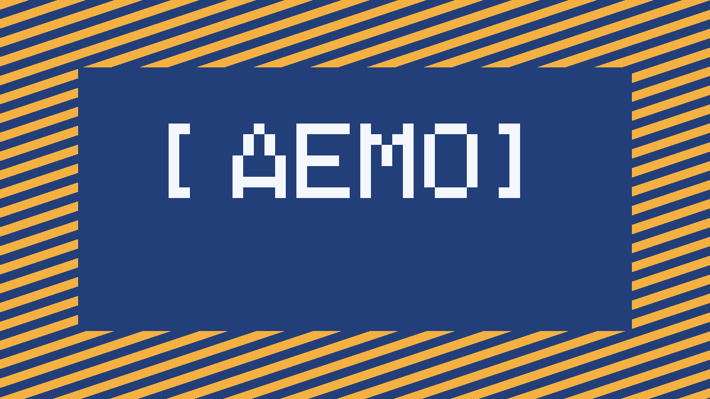
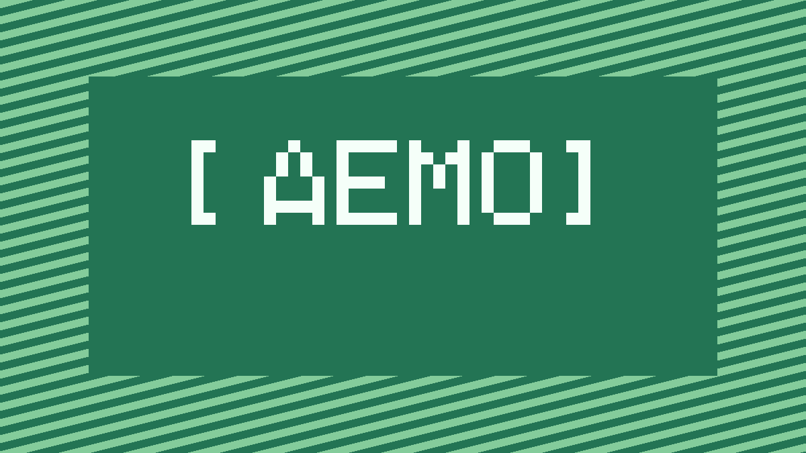
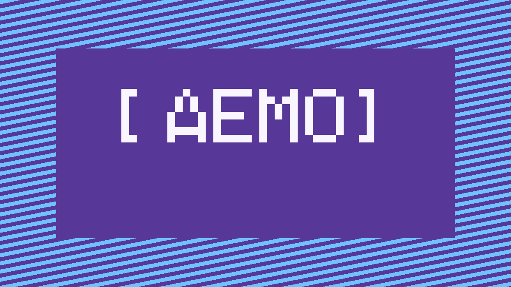
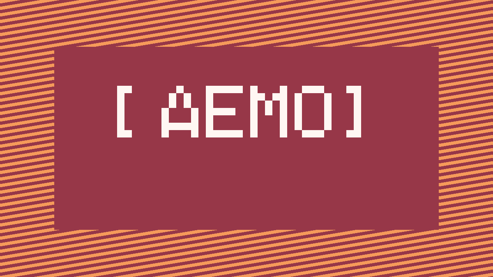
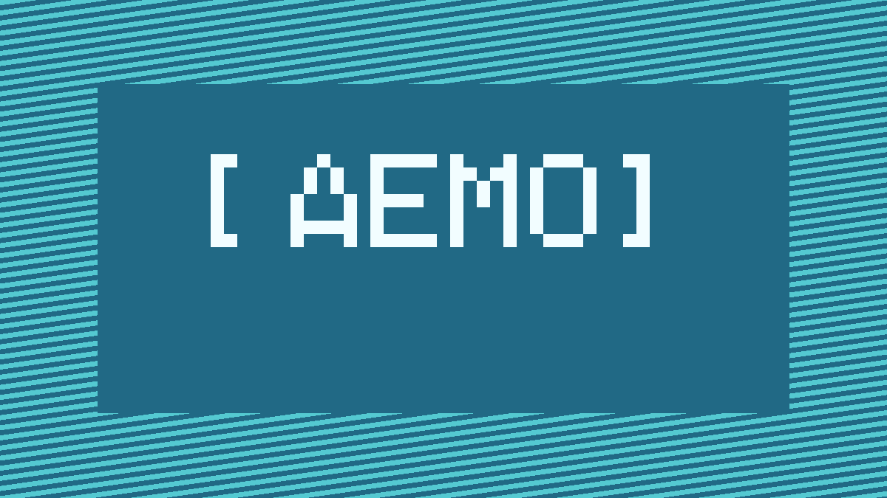
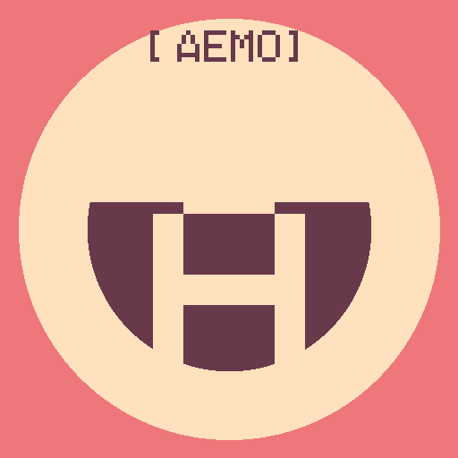

# MEE2-50 — Frozen public artifact v1

This document is the byte-level source of truth for catalog `closed-beta-demo`,
manifest `2026-08-15.v1`. The public PNG bytes are generated by the checked-in
`tools/generate-demo-assets.mjs` source with Node.js `v24.16.0` and bundled zlib
`1.3.1-e00f703`. The generator embeds every glyph as bitmap geometry; it never
loads host fonts, external imagery, metadata, or network resources.

## Visual contract

- Event and community banners: exactly `1200x675`, RGB PNG, calm two-tone palette,
  geometric neutral-branded background, and a large centered `[ДЕМО]` bitmap label.
- Avatars: exactly `512x512`, RGB PNG, calm palette, circular head-and-shoulders
  geometry, a large `[ДЕМО]` bitmap label, and the reviewed Cyrillic initial
  (`А`, `М`, `Е`, `П`, `С`, `И`).
- PNG chunk order is PNG signature, IHDR, IDAT, IEND; raw scanlines use filter 0;
  IDAT uses zlib level 9. Do not resize, optimize, re-encode, color-profile, or
  add metadata.

Run:

```sh
node tools/generate-demo-assets.mjs
```

The checked-in files must match this table exactly:

| Filename | Dimensions | Bytes | SHA-256 |
|---|---:|---:|---|
| `community-moscow.png` | 1200x675 | 12069 | `4cae7410a1e0c9e28491631a59df89b10776ced8e5250d91d01157d2adc158ac` |
| `community-walks.png` | 1200x675 | 12044 | `a4b90e77d01aa3387dfc72288d6565da8fa178730fac43441ac60262235c2ee6` |
| `community-online.png` | 1200x675 | 12050 | `cd0c606d0242e688279b02301e7606132f4493cab83a6a55c7ed164dd0e8ee0d` |
| `meeting-moscow.png` | 1200x675 | 11904 | `674bf6797c1227772bc19e1bca406de9853ca52112d3298cab9a67e84afb1439` |
| `meeting-online.png` | 1200x675 | 12016 | `43378f9e7900f83a0ba86d9244f6f10f09d2f291ce8561f51ddbec5b132e8f46` |
| `avatar-01.png` | 512x512 | 3696 | `48b6c14991eddce94834bff01b7371d0de02c36ad136565e1a37d1171fc0cc40` |
| `avatar-02.png` | 512x512 | 3735 | `06ec16e4bcfd833a15bc16fa8416610769be8a6a444743159626d8317fd94cf8` |
| `avatar-03.png` | 512x512 | 3517 | `bfdd6f5ef6e3d5375d0c21cb7bc59a494f22f80628a35d5ae6c535f3ae5bd940` |
| `avatar-04.png` | 512x512 | 3701 | `1b4a000feaf4fc4bd173590bf8811e8142d74f968f319b2cfb7022d11aae05a6` |
| `avatar-05.png` | 512x512 | 3482 | `f820de837384b5068ca49147bfd7d228751445738d0f3f5e7bbafe8936f2a14b` |
| `avatar-06.png` | 512x512 | 3717 | `ad80b8b4c46e0d30860b872c5a4e8ba557954f66830d3b302eb265521c6fcca2` |

### Preview evidence








## Landing-page byte contract

Each body is UTF-8 without BOM, LF line endings, and exactly one final LF.
The files are served as `text/html;charset=UTF-8` at the exact URLs in the
manifest. They contain no JavaScript, external resource, private room link, or
runtime interpolation.

### `/demo-events/organize-online`

- Bytes: `911`
- SHA-256: `3229a94a4cc9698f5ed09320a80a68ec9b9746e5661a982b872d90157cba72b6`

```html
<!doctype html>
<html lang="ru">
<head>
<meta charset="utf-8">
<meta name="viewport" content="width=device-width,initial-scale=1">
<title>[ДЕМО] Как организовать онлайн-встречу</title>
</head>
<body>
<main>
<h1>[ДЕМО] Как организовать онлайн-встречу</h1>
<p>Публичная информационная страница демонстрационной встречи закрытой беты.</p>
<p>На встрече участники разберут подготовку понятного сценария, правила общения и безопасный формат онлайн-события.</p>
<p>Эта страница не содержит ссылки на комнату подключения. Детали участия доступны в приложении после записи.</p>
</main>
</body>
</html>
```

### `/demo-events/networking-online`

- Bytes: `870`
- SHA-256: `5c7baf9641ba6b602444595199dff14c0cca31125ca3f666f5fd63b9766e0900`

```html
<!doctype html>
<html lang="ru">
<head>
<meta charset="utf-8">
<meta name="viewport" content="width=device-width,initial-scale=1">
<title>[ДЕМО] Нетворкинг без неловкости</title>
</head>
<body>
<main>
<h1>[ДЕМО] Нетворкинг без неловкости</h1>
<p>Публичная информационная страница демонстрационной встречи закрытой беты.</p>
<p>Участников ждут короткие знакомства, спокойные вопросы для начала разговора и бережный формат общения.</p>
<p>Эта страница не содержит ссылки на комнату подключения. Детали участия доступны в приложении после записи.</p>
</main>
</body>
</html>
```

Local tests must read all thirteen classpath resources as bytes, assert these
lengths and digests, decode PNG dimensions/content types, and assert the HTML
content types. The exact-host HTTPS probe runs only after disabled deployment.
